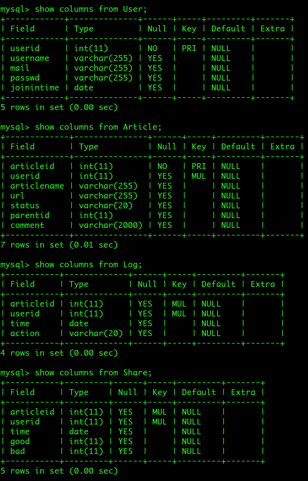

# 创建数据库和相应的表
EDIT@20160929by zdc（关于数据库创建方式存在不同意见请修改本文件）
***
### 数据库名称和表的名称及其内容
```
DB_NAME: DBGHZ
// 用户表： 存储用户id（插入时找最大+1）用户名 邮箱 密码 加入时间（为了时间轴）
TABLE1_NAME: User: userid(PK), username, mail, passwd, joinintime
// 文章表： 存储文章id（插入时最大+1） 用户id 文章名 文章地址 阅读状态 父id（构建树）孩子id 评论
// 孩子id为字符串类型，每个id以特殊字符隔开，如：1#2#5#8#
TABLE2_NAME: Article: articleid(PK), userid(FK), articlename, url, status, parentid， childid, comment
// 日志表： 存储用户id，文章id ，操作时间， 动作内容
TABLE3_NAME: Log:  userid(FK), articleid(FK), time, action,
// 分享表： 存储用户id，文章id，分享时间，赞次数，反对次数
TABLE4_NAME: Share: userid(FK), articleid(FK), time, good, bad,
```
### 创建命令
```
CREATE DATABASE DBGHZ;

USE DBGHZ;

CREATE TABLE User
(
  userid     INT(11) PRIMARY KEY,
  username   VARCHAR(255),
  mail       VARCHAR(255),
  passwd   VARCHAR(255),
  joinintime DATE
);
CREATE TABLE Article
(
  articleid     INT(11) PRIMARY KEY,
  userid        INT(11),
  articlename   VARCHAR(255),
  url           VARCHAR(255),
  status        VARCHAR(20),
  parentid      INT(11),
  childid       VARCHAR(500),
  comment       VARCHAR(2000),
  FOREIGN KEY (userid) REFERENCES User(userid)
);
CREATE TABLE Log
(
  articleid     INT(11),
  userid        INT(11),
  time          DATE,
  action        VARCHAR(20),
  FOREIGN KEY (userid) REFERENCES User(userid),
  FOREIGN KEY (articleid) REFERENCES Article(articleid)
);
CREATE TABLE Share
(
  articleid     INT(11),
  userid        INT(11),
  time          DATE,
  good          INT(11),
  bad           INT(11),
  FOREIGN KEY (userid) REFERENCES User(userid),
  FOREIGN KEY (articleid) REFERENCES Article(articleid)
);
```

### 检查创建结果

```
show tables;
show columns from User;
show columns from Article;
show columns from Log;
show columns from Share;
```

### 查看数据库结构

